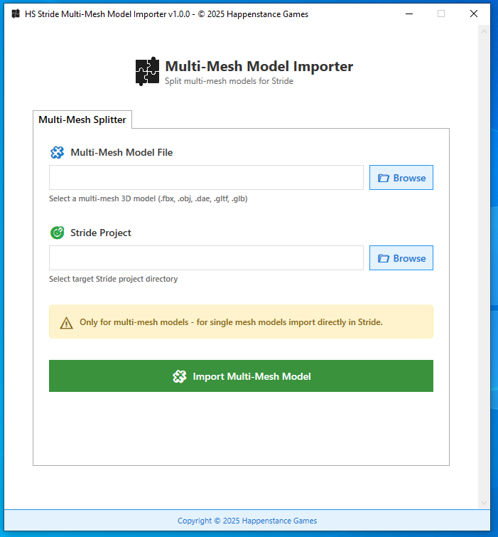
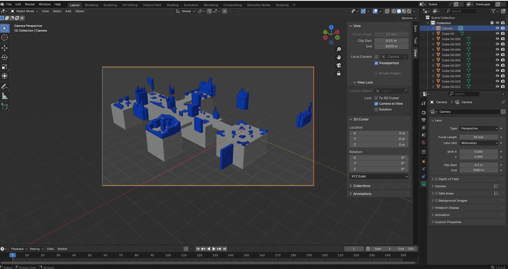
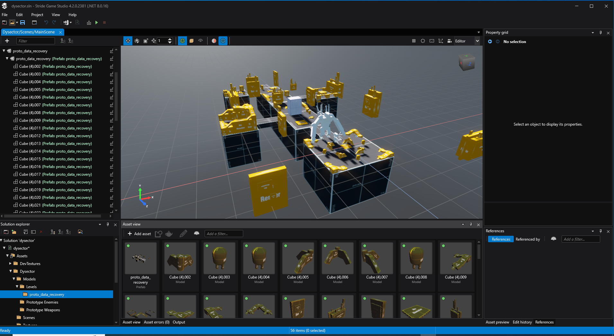

# HS Stride Model Importer

Multi-mesh FBX splitter and prefab creator for Stride Game Engine. Converts flattened FBX imports into individual selectable mesh parts with proper hierarchy and transform data preservation.



## 📸 Example: Before & After

**Before - Complex model in Blender:**

*Multi-mesh model with many parts that would import as single blob in Stride*

**After - Individual parts in Stride:**
  
*Same model now has individual selectable parts and proper hierarchy*

## 🚨 The Problem

Stride can't import multi-mesh FBX files properly. You get a single merged object instead of individual selectable parts.

**What should happen:**
```
Complex_Model.fbx → Import → Individual selectable parts
├── Gun_Body (selectable)
├── Gun_Barrel (selectable) 
└── Gun_Sight (selectable)
```

**What actually happens in Stride:**
```
Complex_Model.fbx → Import → Single blob
└── Gun (can't select individual parts)
```

## ✅ The Solution

This tool splits your multi-mesh FBX into individual meshes and creates a Stride prefab that recreates the original hierarchy.

1. **Splits** your FBX into separate mesh files
2. **Creates** a Stride prefab with proper hierarchy  
3. **Preserves** all transform data (position, rotation, scale)

## 🚀 How to Use

### UI Application (Recommended)
1. **Multi-Mesh Model File:** Browse and select your FBX file
2. **Stride Project:** Browse and select your Stride project folder
3. Click **Import Multi-Mesh Model**

### Console Application  
```bash
HS.Stride.Model.Importer.Console.exe MyModel.fbx ./output/
```

## ⚠️ Important Blender Export Note

**If you're exporting from Blender and experiencing issues with wrong scale or position:**

When exporting FBX from Blender, **enable "Apply Transform"** in the Transform section (marked as Experimental). This is required for proper Stride compatibility.

```
File → Export → FBX
└── Transform Section
    └── ☑️ Apply Transform (Experimental) ← Check this!
```

This ensures transforms are baked correctly for Stride Engine.

## 📁 What You Get

```
Output/
├── Split/
│   ├── MyModel_Part1.fbx
│   ├── MyModel_Part2.fbx
│   └── MyModel_Part3.fbx
└── MyModel.sdprefab
```

## 🔧 Recommended Workflow

1. **Run Model Importer** on your multi-mesh FBX
2. **Create materials** in Stride to assign to models.
3. **Assign materials** to all the models your created.
3. **Drag prefab** into your scene

**💡 Pro Tip:** After creating your materials in Stride, you can select multiple models by clicking the first model, holding Shift, and clicking the last model. Then assign materials to all selected models at once in the Property Grid to save time.

## ⚠️ What This Tool Handles

### ✅ Supported
- Multi-mesh FBX files
- Transform data (position, rotation, scale)
- Mesh geometry

### ❌ Not Supported  
- Material assignments (create materials manually)
- Animations (use regular Stride import,) (Not Tested) 
- Bones/Skeletons (use regular Stride import) (Not Tested) 
- Single-mesh models (import directly in Stride)

## 🔧 Technical Notes

- Built with AssimpNet and .NET 8.0
- Handles files up to 500MB
- Works with 100+ mesh parts
- Creates Stride-compatible prefab files

## 📄 License

MIT License - see LICENSE.txt for full text.

---
Copyright © 2025 Happenstance Games LLC
